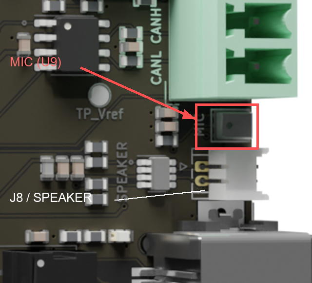

# 麦克风数字信号交叉核对（2026-10-07）

用户确认录音期间持续说话，但 mic-record-02.mp3 只有沙沙声；没有逻辑分析仪、示波器或万用表。本轮利用开发板自身采样 GPIO 输入电平，核对麦克风数字输出与 SSI FIFO，未改变 Flash 固件，也未打开 COM8。

## 测量方法

原理图 U9 为 MSM261S3526Z0CM，SCK 接 P403，WS 接 P404，SD 接 P406，L/R 接地选择左声道。一次读取 PORT4 的 PIDR，同时取得 bit3、bit4、bit6，避免分别读取三根线产生时间偏差。读到的是 MCU 引脚的数字电平，不能测出供电电压、模拟波形或电平裕量。

通过板载 SWD 暂停应用，在 SRAM 临时运行采样程序。最终代码与数据位于 0x20040000～0x200450E0，未覆盖被调用的 Flash 驱动及其控制对象；使用 BSP 实际栈边界。恢复生成表中的三个 SSI 引脚配置，GPT1 周期 39、占空计数 19，SSI 为 24 位数据、32 位时隙、主机模式。以 CPU 排空 FIFO 预热约 1 秒，再连续保存 2000 个端口样本，停止接收并读取 FIFO。采样期间关闭 CPU 中断，不使用 DTC、RT-Thread 录音线程、滤波、压缩、增益或扬声器。

先用 WS_CONTINUE_ON 验证采样方法，随后用与生产配置相同的 WS_CONTINUE_OFF 复核，最终 SSIOFR=00000000。每次操作后均复位回 Flash 固件，包括独立的退出复位；最终 reset.log 记录复位成功。这是临时数字诊断，不替代完整 5 秒录音。

初始普通 C 循环采样间隔过长，未用于位序结论。最终每组展开 8 次端口读写，2000 点耗时 24008 个 CPU 周期；按 CPU 120MHz 计算，约 0.200067ms，平均采样率约 10MHz。另一次 12000 点快照耗时 144012 周期、约 1.2001ms。以下证据来自采样速度已足够的版本。

## 时钟与逐字比对

2000 点快照的 SCK 相邻边沿间隔均为 1 或 2 个采样点，完整 WS 半周期均为 104 点，每个可完整解码的时隙包含 32 个 SCK 下降沿；12000 点快照同样得到 104 点半周期、每时隙 32 个时钟。这与约 3.077MHz SCK、48.077kHz WS 及 32 位时隙一致。速率以 CPU 时钟及短快照估算，不属于晶振精度或长期时序测量。

在 SCK 下降沿读取 SD，按 I²S 的 WS 切换后延迟 1 位，再取 24 位数据。最终快照可解码 10 个左声道、9 个右声道时隙；右声道均为零。FIFO 共读取 20 个字，顺序从快照开始前的右声道零字起，随后为左/右交替，末字为最后一个左声道样本。按这一个字的起始偏移对齐后，10 个左声道逐字完全相同：

| 样本 | SD 电平独立解码（24 位） | SSI FIFO 低 24 位 |
| --- | --- | --- |
| 0 | FF3F16 | FF3F16 |
| 1 | FF3AF5 | FF3AF5 |
| 2 | FF37FE | FF37FE |
| 3 | FF3D30 | FF3D30 |
| 4 | FF3DC1 | FF3DC1 |
| 5 | FF3D84 | FF3D84 |
| 6 | FF3C19 | FF3C19 |
| 7 | FF3D24 | FF3D24 |
| 8 | FF3DDE | FF3DDE |
| 9 | FF3E2B | FF3E2B |

GPIO 采样看到 SD 在 SCK 高电平阶段变化，直接在上升沿附近按 GPIO 快照取数可能受采样相位影响。本次比对使用上述下降沿、延迟 1 位的方法，未据此修改 SSI 时钟极性。前一轮 WS_CONTINUE_ON 的 10 个左声道也逐字匹配；主结论以 OFF 的复核为准。

最终诊断寄存器及返回值：

```text
magic=4D494357 done=444F4E45
pin_restore=success GPT_Open=0 GPT_Start=0 SSI_Open=0 SSI_Close=0
SSICR=402B4201 SSIOFR=00000000 SSISR=00000000
FIFO_words=20 left_matches=10/10 right_words_all_zero=true
trace_samples=2000 CPU_cycles=24008
CFSR=00000000 HFSR=00000000
```

本机原始证据保存在 logs/audio-wire-check：wire.c、wire.elf、run.py、analyze.py、commands.txt、result.log、reset.log、trace.bin、fifo.bin、report.bin、decoded.json、comparison.json。WS_CONTINUE_ON 对照文件带 continuous 后缀，较长快照带 12000 后缀。临时程序通过当前 Debug/rtthread.elf 的符号地址调用 Flash 驱动，不能拿它去连接其他固件版本。logs 为本机忽略目录，临时文件未作为通用诊断工具提交。

## 结论与下一步

本次快照中，SD 输出的位序、24 位数据及声道与 SSI FIFO 完全一致。因此已经有直接证据支持当前 SSI 格式能读到引脚上实际输出的数据，单纯调增益或换对齐方式缺少依据。

快照没有安排用户同步发声，覆盖不足 1ms，不验证 5 秒 DTC/队列的全部数据，也不证明麦克风声学输出正常。此前 5 秒采集无溢出、导出与 CRC 完整，用户仍听不到人声。结合两项证据，下一步优先检查实际拾音孔和 U9 的供电/器件，而不是宣布麦克风损坏；供电、焊接、器件原厂时序要求及长期接收仍存在未验证部分。

用户没有测量仪器，先做可直接确认的外观与拾音方向检查。以下图来自仓库既有 docs/picture/back.png 的裁剪与标注，是板卡渲染图，不是本次生成的实物照片。按图方向摆放，MIC/U9 在元件面右侧、绿色 CAN 端子下方、白色 J8/SPEAKER 插座上方。对照实际丝印，检查拾音孔是否被保护膜、胶或外壳遮挡。



后续用户已完成mic-record-03，仍只有沙沙声，并明确反对以2～3cm作为验收条件。已取消近距离录音前提，按正常说话距离录不到人声继续排查。位置图作为器件识别参考，不作为要求用户重复贴近录音的依据。

官方源码对照见 [audio-official-review.md](audio-official-review.md)。下一项为 [CPU直读FIFO对照](audio-fifo.md)，以完整5秒全速PCM16绕过DTC、线程队列、滤波和降采样，检查自写连续采集流程。供电、声学器件及完整时序仍未验收，现有数字采样不能代替这些检查。
