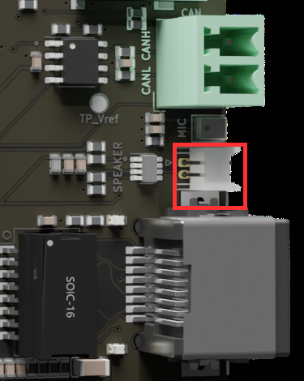
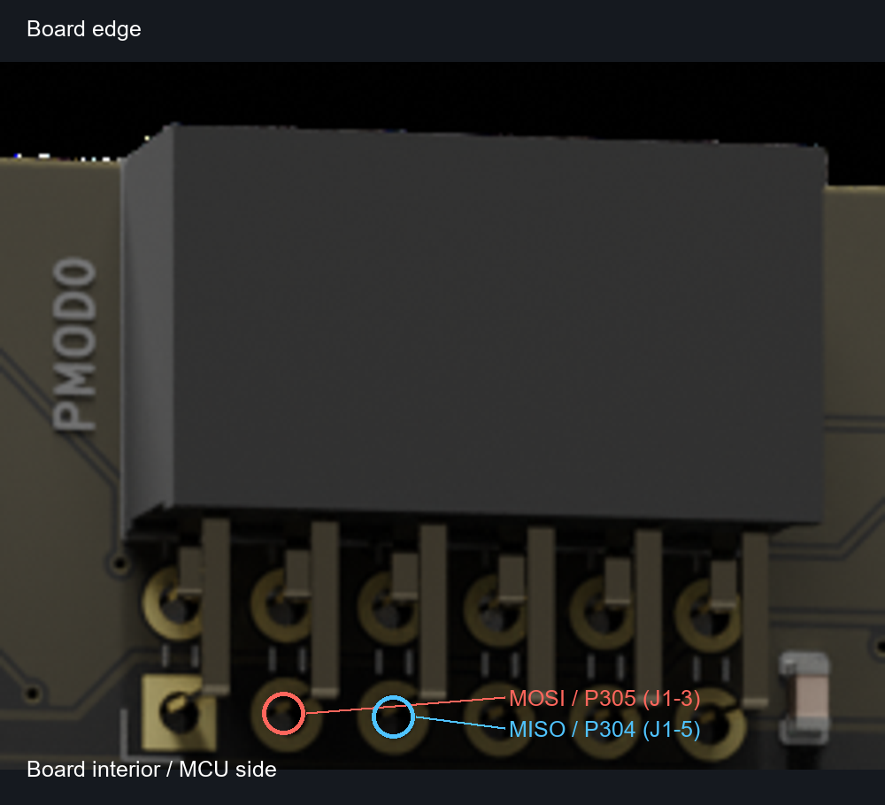
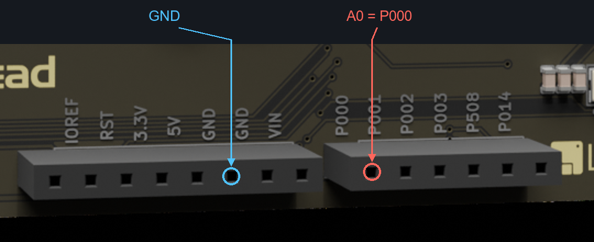

# HMI-Board 独立外设测试使用手册

适用 HMI-Board V3.1、RA6M3、RT-Thread Studio、480×272 ST7282/GT911。完整文件目录和代码阅读方法见 `peripheral-code-quality.md`，实际结果见 `peripheral-test-results.md`。

## 构建与命令

```powershell
python scripts/build_flash.py
```

MSH 只在 `src/test-main.c`。每条有效测试命令创建一条新线程，运行时其他测试返回 `TEST BUSY`，退出清理后才能运行下一项；不存在常驻测试工作线程。`hal_entry.c` 保留原样。所有测试文件位于 `src/test/`，独立初始化，无前置测试依赖。

```text
hmi_test help
hmi_test eth-mac
hmi_test eth-lwip
hmi_test status
hmi_test stop
```

- `PASS`：本例程序断言通过，不代表同一外设所有功能均通过。
- `WAIT`：执行完成，仍需视觉、听觉、操作或对端数据比对。
- `SKIP`：缺少卡、链路、USB 枚举等测试条件。
- `FAIL`：驱动错误、数据不一致、超时；主动停止使用 `code=-9`（`-RT_EINTR`），与正常验收区分。
- `status` 按独立例程显示运行次数和最近结果。`help/status/stop` 为管理命令，不创建测试线程。
- `stop` 只发停止事件；例程自行停止硬件后返回，不强行删除正在使用 DMA 的线程。FSP 内部硬件等待不保证可抢占，故障无法退出时需复位。
- 旧命令 `hmi_test eth mac` 改为 `hmi_test eth-mac`。旧 `all` 改为由电脑脚本逐条发命令，不在一条板端线程内批量调用测试。

## 有时限的自动采集

```powershell
python scripts/test_peripherals.py
python scripts/test_peripherals.py --command "hmi_test eth-phy" --command "hmi_test eth-mac"
python scripts/test_peripherals.py --command "hmi_test eth-lwip" --timeout 90
python scripts/test_rw007_internet.py --ssid Hotspot
```

脚本默认 COM8/115200，结束或异常均关闭串口。先关闭自己占用 COM8 的终端。日志在 `logs/`，不提交原始串口日志。退出码 0 只表示没有 FAIL/脚本错误，WAIT/SKIP 不会被当成人工验收通过。默认基础批次不执行文件写入、外接跳线测试或手机交互测试。

## P01 有线网口：PHY → 回环 → lwIP

源码：`src/test/test-eth-phy.c`、`test-eth-mac.c`、`test-eth-phyloop.c`、`test-eth-link.c`、`test-eth-lwip.c`；每个文件包含自己完整的流程。物理数据通过 RA6M3 Ethernet MAC/EDMAC、RMII、RTL8201F，独立于 RW007。

依次执行：

```text
hmi_test eth-phy
hmi_test eth-mac
hmi_test eth-phyloop
hmi_test eth-link
hmi_test eth-lwip
```

1. `phy`：硬复位 PHY，通过 MDIO 读取 ID/BMCR/BMSR，拒绝全零/全 FF ID。实测 ID 为 `001C:C816`。
2. `mac`：MAC 内部回环，实际 DMA 发送/接收 12 帧，分别覆盖 60/512/1514 字节，逐字节校验。无需网线。
3. `phyloop`：PHY BMCR 数字回环，固定 100M 全双工，实际经 RMII 收发并校验同样的 12 帧。无需短接 RJ45；不验证网线、变压器到对端的模拟链路。
4. `link`：接路由器的 LAN 口，等候物理链路与协商。输出速度/双工枚举及 ECMR；确认 LINK 灯，ACT 灯在通信时闪烁。
5. `lwip`：取得 DHCP 地址 → DNS → TCP → HTTP，访问 `http://www.msftconnecttest.com/connecttest.txt`。只有 HTTP 200 且响应正文匹配 `Microsoft Connect Test` 才通过。不是 HTTPS 或长期稳定性测试。

网口使用 MCU 唯一 ID 派生的本地管理 MAC，4 个 RX/2 个 TX 描述符。回环阶段只为 FSP 提供强制速率/链路配置，PASS 必须收到正确数据，不能靠强制的链路状态判定通过。每项结束关闭 MAC，回环设置被清除。

最终拔插验收：拔掉网线运行 `link`，应在约 6 秒后 SKIP；重新插入后重跑 `link`、`lwip`，应恢复成功。该例程每次重建连接，不提供后台自动重连服务。

## P02 TF 卡：介质 → 只读 → FAT 文件

源码：`src/test/test-sd-info.c`、`test-sd-read.c`、`test-sd-file.c`；库引擎为 `board/fatfs-engine.c`。使用已有 FatFs 引擎和 FSP SDHI1/DMAC，不启动另一个 DFS/SD 后台线程。

```text
hmi_test sd-info
hmi_test sd-read
hmi_test sd-file
```

- `info`：卡检测、初始化、扇区数、512 字节扇区大小、时钟和写保护。卡座 CD 接 P405，三个例程独立将其配置为上拉输入，低电平表示插卡；日志 `SD P405 detect=1` 表示检测到卡，`detect=0` 表示未检测到。此引脚不是 SDHI1 的专用 CD 输入，因此例程关闭专用 CD 检测并自行查询 GPIO，不能用 `R_SDHI_StatusGet` 的 `card_inserted` 代替实际插卡检测。
- `read`：对扇区 0 连续读取两次并比较；不会写入卡。
- `file`：需已格式化为 FAT16/FAT32 的卡。按顺序用 `FA_CREATE_NEW` 尝试 `HMI00.TST`～`HMI99.TST`，不覆盖已存在的文件。写入 8192 字节已知模式，sync/close，卸载并重新挂载，读回全部内容和长度校验。文件保留供电脑检查，测试后可自行删除。
- 无卡为 SKIP；无可用文件名或文件系统不支持会报错，**不会自动格式化、删除或裸写扇区**。
- 每项关闭 SDHI；最终可拔卡重跑 `info`，插回后重跑 `file`。不要在写文件时拔卡。
- 传输等待、FatFs 介质状态和同步路径均检查 P405，发现拔卡或读取检测脚失败则退出报错；这是故障检测，不保证写入过程中拔卡不会损坏文件系统。

## P03 CAN：内部回环 → 对端收发

源码：`src/test/test-can-loop.c`、`test-can-bus.c`。统一使用 **500 kbit/s，标准数据帧，8 字节**。

```text
hmi_test can-loop
hmi_test can-bus
```

`loop` 使用控制器内部回环，8 组不同载荷，逐字节验证 ID、帧类型、DLC、数据及 TX/RX 事件，无需外接节点。

`bus` 需要 USB-CAN 或另一节点：CANH 对 CANH、CANL 对 CANL、共地，确认两端终端匹配。板载已有约 120Ω 分裂终端，勿无条件额外叠加终端。

板端发送 ID `0x321`，数据 `00 01 02 03 04 05 06 07`；对端收到后，在 10 秒内回复 **ID `0x322`、相同 8 字节**。须同时观察到 TX 完成、正确回复及零错误事件。对端应处于正常模式以提供 ACK。无 ACK/超时是 FAIL，不能当作内部回环通过后的“自动通过”。

## P04/P05 音频：采集 → 输出 → 回放

源码：`src/test/test-audio-mic.c`、`test-audio-tone.c`、`test-audio-replay.c`。数字麦克风在 I²S 左声道；FSP 的 24 位数据右对齐，程序显式符号扩展。

扬声器接板背面标有 `SPEAKER` 的白色 2 针插座，不是 3.5mm 耳机孔。按仓库背面图的方向看，该插座在右侧边缘、绿色 CAN 端子下方、RJ45 网口上方，紧邻 MIC。下图红框标出插座：原图来自本工程 `docs/picture/back.png`，在初始化提交 `11cfc7a` 中已存在；助手只裁剪并添加红框，没有生成板卡图像。



已核对 RT-Thread Studio 安装包 `RealThread/HMI-Board/1.2.0/documents/hmi-board-v3.1-schematic.pdf` 的 Audio 页（PDF 第 12 页，图纸标识 11/13，V3.1）：插座为 **J8，DF13-2P-1.25DSA，2 针、1.25mm 间距**。选配线端插头时按 DF13 系列匹配，不能只凭“1.25mm 两针”判断兼容。

| J8 引脚 | 原理图连接 | 用途 |
| --- | --- | --- |
| 1 | U10/AP4580 的 7 脚 | 一个桥臂的音频驱动输出 |
| 2 | U10/AP4580 的 6 脚 | 另一个桥臂的音频驱动输出 |

设计用途是把合适的两线无源喇叭直接接在 J8 两针之间，由板载 AP4580 桥式电路驱动，无需额外给喇叭供电。电路电源为 3.3V，经 F2 保护后供给 U10；**J8 不是 3.3V/GND 电源口，两针都不是地**。不要给 J8 外加电源，也不要将任一输出接地或直接转接共地耳机/有源音箱输入。连接负载前断电，针号以实物焊盘/连接器定义为准，不按照片上下方向猜极性。该原理图没有给出推荐扬声器阻抗和额定功率，仍需按板卡配套规格确认负载后再试听。

```text
hmi_test audio-mic
hmi_test audio-tone
hmi_test audio-replay
```

- `mic`：GPT1 提供音频时钟，经 SSI/DTC 接收 8192 个双声道帧，实际采样率约 16026 Hz。检查接收完成和左声道有变化，输出最小/最大值；约 0.51 秒。采样数据有变化不能单独证明拾音品质，最终需静音/说话对比。
- `tone`：GPT6 PWM 载波、GPT2 采样更新，输出约 0.5 秒低幅方波提示音；检查输出样本数后返回 WAIT，需接扬声器试听。
- `replay`：先采集约 0.51 秒，再降低幅度回放。命令开始时发声，观察能否听到自己的声音；此演示不保存 WAV，不做连续录放。
- PWM 两桥臂围绕 50% 作有限差分变化；退出后停止两个定时器并将两控制脚置低。

扬声器接口是本地 PWM 音频，不代表 RW007 支持 A2DP；已取消的 ble-sound 不在本轮重新实施。

## P06 USB Device：枚举 → 二进制 ECHO

源码：`src/test/test-usb-probe.c`、`test-usb-echo.c`、`board/tusb_config.h`；TinyUSB 0.17.0 的 RUSB2 USBFS + CDC。

使用接 RA6M3 的**系统 USB Type-C**（原理图 Con4）；ART-Link 调试 USB（Con5）和 COM8 是另一条通路。系统接口接电脑后应出现 `HMI USB CDC Echo` / 新的串口。

```text
hmi_test usb-probe
hmi_test usb-echo
```

`probe` 和 `echo` 等待枚举最多 15 秒。`echo` 在枚举后提供 30 秒回显窗口，原样回显收到的字节，不进行换行转换。设备输出 RX/排队 TX/发送完成事件统计；最终接收正确性由电脑比对，设备侧返回 WAIT。

知道新串口号后可使用自动主机比对，例如新端口为 COM12：

```powershell
python scripts/test_peripherals.py --command "hmi_test usb-echo" --usb-port COM12 --timeout 45
```

工具发送全部 0～255 字节及跨包数据，包含 NUL、FF 和 CR/LF，并逐字节比较回显。`--port COM8` 是控制口，`--usb-port` 必须是系统 USB 新端口。重复拔插后重新执行。测试结束设备断开 CDC 并关闭 USBFS。

枚举失败时保留完整 `USB start` / `USB enumeration` 日志：

- `VBUS_pin` 是 P407 电平，`VBSTS` 是 USB 控制器检测值；两者均不能证明 D+/D− 通信正常。
- `DPRPU=1` 表示 D+ 上拉已打开；`UCK=40` 对应本工程 PLL 240 MHz 除以 5，预期 USB 时钟为 48 MHz。
- `irq` 是 USB 中断进入次数；`reset` 是控制器上报的总线复位次数；`setup` 是收到的控制请求次数。
- `desc_device` / `desc_config` 是协议栈调用描述符回调的次数，不等于主机已成功接收；仅 `mounted_events>0` 表示完成配置。
- 未收到 reset/setup 时继续查连接、上拉、时钟和中断；有请求但未配置时结合描述符计数和电脑设备状态排查。不能只凭一个计数断定线材损坏。

电脑测试：将 A-to-C 数据线接系统 Con4，保留调试口连接，执行 `hmi_test usb-probe` 并等到 `TEST IDLE`。枚举成功可能立即退出并断开 CDC，因此新串口不一定持续显示；需要持续收发时使用 `usb-echo`。手机显示充电只说明供电相关状态，设置搜索“OTG未安装”也不足以判断手机是否支持 USB 主机模式。

描述符使用示例 VID/PID `CAFE:4001`，仅作本板开发测试。USBFS IRQ 40、P407 VBUS 和 48 MHz USB 时钟属于接入要求。

## P07 按键、LED、复位和调试串口

源码：`src/test/test-gpio-*.c`。

```text
hmi_test gpio-inputs
hmi_test gpio-led
hmi_test gpio-keys
```

- `inputs` 显示 P005/P006/P007 电平，按下为 0。
- `led` 依次驱动 P209/P210 两个低有效红灯和 P204（Arduino D13）的高有效蓝灯；人工确认逐个变化，返回 WAIT。
- `keys` 开放 15 秒窗口，每 5 ms 采样、4 次稳定后确认变化；输出按下/抬起、短按/长按（800 ms 分界）和计数。三个键都观察到完整按下/抬起才 PASS，长按/消抖效果仍需人工检查。
- 复位键只作人工测试：按下后应重新输出 RT-Thread 启动信息及测试调度器就绪，状态清零。程序不替代物理复位键测试。
- ART-Link SWD 下载、UART9/COM8 命令及回传由构建烧录和有时限的串口脚本验证；外接调试器排针仍需实物连接。

## P08/P09 LCD、背光和触摸

源码：`src/test/test-lcd-colors.c`、`test-lcd-backlight.c`（LCD）及 `test-touch-info.c`、`test-touch-points.c`、`test-touch-irq.c`（GT911）。

```text
hmi_test lcd-colors
hmi_test lcd-backlight
hmi_test touch-info
hmi_test touch-points
hmi_test touch-irq
```

`colors` 显示红绿蓝白黑，检查 GLCDC 中断持续产生；`backlight` 显示白色，通过 P100/GTIOC5B 执行 0→100→0% 的 PWM 阶梯，每档相差 20%、保持 1 秒，总计约 11 秒。0% 应熄灭背光，100% 应最亮；中间档位的感知亮度不要求线性变化。两项均需视觉验收，结束后等待 GLCDC 在帧边界停稳并关闭背光。注意 P100 对应 GPT5 的 B 输出，不能使用 `GPT_IO_PIN_GTIOCA` 调节该引脚。

`info` 复位并读取 GT911 身份和 480×272 范围；`points` 持续 15 秒读取最多 5 个触点、ID、坐标并清除数据就绪标志，检查坐标界限。视觉位置、抬手、多点轨迹仍按已有画板/LVGL 例程复验。

`irq` 在独立配置 P004 的 IRQ 输入和 IRQ9 下降沿后，开放 15 秒窗口供点击、滑动和松手。回调只计数，线程轮询读帧作为对照；读到触点且中断计数大于 0 才 PASS，读到触点但中断始终为 0 则 FAIL，无人触摸则 WAIT。计数不要求等于点击次数；本项验证中断链路，不验证每一帧都由中断唤醒。GT911 的 0x14 和 0x5D 都是合法地址，复位时 INT 电平决定地址选择。

三个界面例程可以依次独立运行：

```text
hmi_test lcd-touch
hmi_test lcd-lvgl
hmi_test lcd-touch-lvgl
```

每项最多运行 60 秒，也可 `hmi_test stop` 提前结束，等 `TEST IDLE` 后再启动下一项。无需修改宏或重新烧录。显示和手势操作仍需目视/触摸验收。

## P10 RW007

统一调度器提供独立有限测试：

```text
hmi_test rw007-info
hmi_test rw007-wifi
hmi_test rw007-ble
hmi_test rw007-adv
```

复用已验证的原驱动，每项复位、执行、关闭；`adv` 保持约 15 秒供手机观察，返回 WAIT。固件初始全 FF SPI 应答会重试，日志保留该现象。

联网使用 `hmi_test rw007-internet <ssid> <password>`，或 `python scripts/test_rw007_internet.py --ssid Hotspot` 交互输入密码。凭据不写入源码。BLE 通用串口/遥控的固件限制仍见 `ble-capabilities.md`。

## P11 Arduino/Pmod/ADC 扩展接口

源码：`src/test/test-pmod-*.c`、`src/test/test-gpio-*.c`、`src/test/test-adc-*.c`。以下回环**先按表接跳线**，测试时取下会驱动同一线路的外接模块。建议 GPIO 输出到输入串联 1 kΩ，使用板上 3.3 V 电平。

| 命令 | 接线 | 校验 |
| --- | --- | --- |
| `hmi_test gpio-loop` | Arduino D2/P008 → D9/P009 | 16 次高低电平逐次比对 |
| `hmi_test pmod-spi0` | Pmod0 J1 的 MOSI/P305（原理图 J1-3）→ MISO/P304（J1-5） | SCI6，1 MHz，8×64 字节回环 |
| `hmi_test pmod-spi1` | Pmod1 J2 的 MOSI/P613（原理图 J2-3）→ MISO/P614（J2-5） | SCI7，同上 |
| `hmi_test pmod-arduino` | Arduino D11/P512 → D12/P511 | SCI4，同上；D13/P204 为 SCK，D10/P712 为 CS |
| `hmi_test pmod-irq0` | Pmod0 GPIO0/P211（原理图 J1-4）→ IRQ/P708（J1-2） | IRQ11，16 个双边沿中断 |
| `hmi_test pmod-irq1` | Pmod1 GPIO0/P710（原理图 J2-4）→ IRQ/P709（J2-2） | IRQ10，同上 |
| `hmi_test pmod-i2c` | Arduino SCL/P202、SDA/P203 接 3.3 V I²C 设备，7 位地址 0x50，并共地/合适上拉 | 只读 1 字节应答；不校验该设备内容 |
| `hmi_test adc-sample` | A0/P000，可先悬空观察 | 32 次转换、极值、均值，仅 WAIT |
| `hmi_test adc-low` | A0/P000 接 GND | 所有读数 <100 |
| `hmi_test adc-high` | A0/P000 接板上 3.3 V | 所有读数 >3995 |

`pmod-spi0` 先执行低速接线诊断：P305 输出 0/1/0/1，P304 上拉输入读回，出现 `wire PASS` 后再切换 SCI6。若 `wire FAIL`，先核对插孔、跳线及接触；若已进入 SCI6，则根据 `open/start failed fsp=...`、`transfer error ... event=...`、`timeout` 或 `mismatch ... TX=... RX=...` 定位。只有最终 `8x64 bytes MATCH` 和 PASS 才代表 SPI 回环通过。该阶段诊断目前仅加入 Pmod0 例程。

### Pmod 排序与方向

用户实物反馈的 PMOD0 箭头方向与工程参考渲染图的插座方位不一致，目前未确认原因。下图只作参考图中焊点定位，不按“靠无线模块”这一位置直接断定用户实物端口。以电气映射为准：spi0=SCI6/P305/P304，spi1=SCI7/P613/P614；用户保持同一跳线后，spi1 已完成 8×64 字节 MATCH，确认当前接线使 P613/P614 回环成功；之后移线复验 spi0，P305/P304 的 0/1/0/1 检查及 SCI6 的 8×64 字节校验均通过，两组回环均已验收。不能从一次 FAIL 推断接口身份，也不将该对照结果解释为板卡丝印错误。

以下采用 V3.1 原理图的奇偶交错针号，不混用通用 Pmod 文档中可能出现的按排连续编号。此前接线表将 MOSI/MISO 写成 2/3、GPIO0/IRQ 写成 8/7，均不能作为本板原理图针号使用，现已更正。

从元件面看，按 `docs/picture/back.png` 的方向（USB 左、网口右），PMOD0 在上方两个 Pmod 插座中的右侧。以 PCB 上可见的两排焊脚为定位依据，从印有 PMOD0 的左端向右：

| PCB 焊脚位置 | 第 1 列 | 第 2 列 | 第 3 列 | 第 4 列 | 第 5 列 | 第 6 列 |
| --- | --- | --- | --- | --- | --- | --- |
| 靠板边的一排 | IRQ / 2 | IO0 / 4 | IO1 / 6 | IO2 / 8 | GND / 10 | 3V3 / 12 |
| 靠板内、MCU 的一排 | CS / 1 | MOSI / 3 | MISO / 5 | SCK / 7 | GND / 9 | 3V3 / 11 |

MOSI 与 MISO 在同一排，相邻。回环连接靠内排的第 2、3 列，即 P305/P304。方形焊盘是靠内排最左端的 J1-1/CS，作为计数起点。图中圆圈标的是 PCB 焊点，用于辨认位置；插座为弯脚结构，从板外正对插孔观察时视角改变，不能把本图左右、靠边/靠内直接当作插孔上下。不确定插孔对应关系时，断电后用通断档核对目标插孔与圈出的焊点。



图片由工程原有 back.png 渲染图裁剪并标注；信号与原理图针号依据 V3.1 原理图 PDF 第 3 页 J1/J2，方向依据元件面图的方形 1 脚焊盘。短接 MOSI 与 MISO 不分跳线方向，关键是选中正确的一排和两个位置。

### ADC 接线位置：板上标的是 P000

Arduino A0 是功能名称，本板背面丝印使用 MCU 引脚名 **P000**。按工程原有 `docs/picture/back.png` 的方向摆放：元件面朝上，两个 USB 口在左侧，网口在右侧。底边右侧有一组 6 孔排母（原理图 J6），从左到右对应 P000、P001、P002、P003、P508、P014；**最左孔 P000 即 A0**，靠近左边电源排母的 VIN 一侧。V3.1 原理图 PDF 第 3 页确认 J6 第 1 脚为 ARD_ANA_00，连接 MCU P000。

下图基于仓库原有板卡背面渲染图裁剪并加标注，不是本次生成的板卡外观。红圈为 P000/A0，蓝圈为相邻电源排母上的一个 GND 孔。以实际板上丝印为准，避免将邻近 VIN、5V 当作 GND。



低端测试：断电，将红圈 P000 与蓝圈 GND 用跳线连接；上电执行 `hmi_test adc-low`。A0 悬空采样仅检查转换流程，接地后才可按低端阈值验收。

ADC 为 12 位，估算电压假设参考为 3.3 V；输入限于 0～3.3 V，不能接 5 V。这里只验证 A0 通道，其他模拟脚不是逐脚产测。P202/P203 与 GT911 共用 I²C，因此不同时运行持续触摸例程。Pmod IRQ 与部分用户按键复用中断通道，调度器串行运行并关闭 IRQ。

## P12 RTC

```text
hmi_test rtc-tick
hmi_test rtc-alarm
```

使用板上 32.768 kHz 晶振。每条命令先固定等待 2.2 秒让晶振稳定，再初始化 RTC 并设为测试日期 `2026-10-01 12:00:00`，随后观察 3.2 秒并读取走时；`alarm` 同时验证 RTC 计时第 2 秒闹钟中断恰好一次。加上驱动初始化和清理，**整条命令约 5.5～6 秒**，用户实测两项均为 5513ms；不能将 3.2 秒观察窗口当作命令总耗时。即使晶振此前已运行，这两个独立例程也会执行固定的 2.2 秒等待。结束关闭 RTC 并停止计数。**这是会改写 RTC 时间的测试，不是实时时钟应用。**

VBATT 在原理图中接 3.3 V，没有独立后备电池，不把断电保持作为验收条件。更长时间的精度比较需外部时钟。

## P13/P14 JPEG、2D 加速

```text
hmi_test graphics-jpeg
hmi_test graphics-g2d
```

- JPEG：内置 16×16、RGB(128,128,128) 的已知 baseline JPEG。复制到对齐的 SRAM 输入缓冲并采用完整输入模式，验证尺寸、16 行完成事件、全部 RGB565 像素（允许一个量化步差异）。实测像素 `0x8410`。
- G2D：硬件对 16×16 RGB565 缓冲填红色，再绘制中央 8×8 绿色矩形，逐像素检查。渲染完成轮询有上限；正常退出释放 D/AVE 缓冲及设备，使用 RT-Thread 堆。
- 这两项可独立于 LCD 视觉效果判定硬件计算正确；没有据此声称视频播放或所有图形操作已覆盖。

## 维护和构建注意事项

源码职责、注释约定、格式检查与主机回归方法见 `peripheral-code-quality.md`。

`scripts/configure_peripheral_tests.py` 补全 Studio 头文件搜索路径；根 `SConscript` 声明 USB 源码。RTC/ADC 驱动与原工程 FSP v3.5.0 一致；TinyUSB 来源/许可见 `third_party/tinyusb/README.hmi.md`。

`ra_gen/vector_data.c/.h` 新增 USBFS 40、RTC alarm 41、RTC carry 42。FSP 重新生成后须保留/重新配置这三个中断，不能只看 C 文件编译通过。没有全局启用 BSP_USING_ETH/SDHI 等自动初始化，防止与测试直接使用 FSP 控制器冲突。

固件始终包含全部独立例程，上电不自动测试。最终验收按任务书准备网线/路由器、FAT 卡、CAN 对端、系统 USB 数据线、扬声器与跳线。
